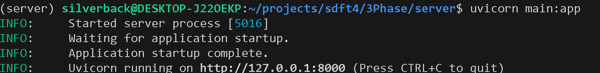

# GET REQUESTS WITH FASTAPI

#### Note:
We will be using pipenv to toggle our virtual environment and install and manage our dependencies though you are allowed to use a tool of your choice. 

#### Introduction 
To get started create a folder called server.   
Within the folder server create three files 
``` 
server/
    - main.py
    - models.py
    - seed.py 
 ```
1. main.py - Here we will write the code for the fastapi server endpoints
2. models.py - This file will contain our models (the database table schemas for our application ) 
3. seed.py - This file will contain sample data to be added to our database table for use during the development process.  

As was mentioned at the end of the introduction we wil be using fastapi inconjunction with a couple of dependencies i.e pydantic, sqlalchemy uvicorn and alembic.    

Go the terminal within the server directory.    

create a virtual environment.   
    ``` pipenv shell ```     
Install the necessary dependencies  
``` pipenv install fastapi pydantic uvicorn sqlalchemy alembic ```      

In the spirit of keeping things simple at the begin by adding an endpoint that returns a response to the user in the format.     
``` {'msg' : 'Welcome to fastapi'}```   

To acheive this:    
1. Within the main file start by importing the Fastapi class from the fastapi module.  
``` from fastapi import FastAPI ``` 
2. Create an instance off the fastapi class.    
``` app =FastAPI() ```
3. Create a function called index that will return data to the client as stated above.   
``` 
def index():
    return {'msg' : 'Welcome to fastapi'} 
```     
4. Decorate the fucntion with the get method of the app instance we had created earlier passing a string with a foward slash to be able to respond to to get requests when a user visits the root endpoint.     

``` 
@app.get('/')
def index():
    return {'msg' : 'Welcome to fastapi'} 
```     

5. Open your terminal and run your server using the command   
``` uvicorn main:app ``` 

6. If all you did was error free you should see info on the terminal similar to the one below.  

 

open your terminal and navigate to the endpoint indicated by default it should be    
http://127.0.0.1:8000       

You should see the output as we had stated earlier. 

###   Creating our models
Now of course we well be doing much more than this in conjunction with a database through the sqlalchemy ORM and alembic. 

The next step is to create our models  

within the model.py file import the following   
```
from sqlalchemy import create_engine, Column, Integer, String
from sqlalchemy.orm import declarative_base, sessionmaker
```

Create a new instance of the declarative_base class from which all mapped classes should inherit. 

``` Base = declarative_base() ```   

create a new model based of the declarative base instance.  
```
class Student(Base):
    __tablename__ = 'student'
    id= Column(Integer,primary_key=True)
    first_name = Column(String(40), nullable=False)
    last_name = Column(String(40), nullable=False)
    age = Column(Integer, nullable=False)
    home_town = Column(Integer, nullable=False)

    def __repr__(self):
        return f'<Student: {self.first_name}>'
```

Add other necessary configurations to work with our ORM

```
# connect to a database engine (in this case sqlite) 
# and create a session object to use in interacting with our database
engine= create_engine('sqlite:///db.db')
Base.metadata.create_all(engine)
Session = sessionmaker(bind = engine)
session = Session()
```

### Running migrations with alembic 

The next step is to migrate our Database    

open the terminal and run the command   
``` alembic init alembic ```    
This command will create a new folder called alembic that will contain our migrations and other configurations files. It will also create a file called almbic.ini 

In the alembic.ini file replace the value assigned to sqlalchemy url with   `sqlite:///db.db` 

i.e  ` sqlalchemy.url = sqlite:///db.db `   

Within the alembic folder in the file named env.py, import Base from the models  
``` from models import Base ``` 

In the line that has target_metadata, assign it the value Base.metadata  
i.e ``` target_metadata = Base.metadata ``` 

once you have done this open the terminal and create a revison with the command

``` alembic revision --autogenerate -m "Create Student Database" ```    

since we are using SQLite we can use the VSCode extension [SQLITE](https://marketplace.visualstudio.com/items?itemName=alexcvzz.vscode-sqlite) to View our database. We should get output that looks like this. 

   

### Seeding Data to our Database    
The next step is to populate our database with dummy data. 
We will now write code in our seed.py file. 
We will start by installing the faker package to use for generating random data.    
``` pipenv install faker ```    
In the seed.py file, import the Faker class from faker, thereafter import session and the Student model. We will also require randint from the random python package.   
```
from faker import Faker
from models import session, Student
from random import randint
```  

Therefater create an instance of the faker class and create a new variable called students to store all the student instances we will create.   
``` 
faker = Faker()
students = []
``` 


